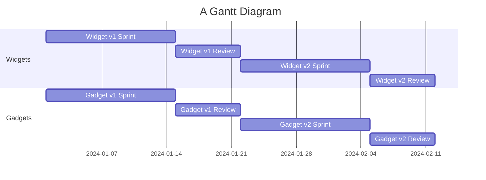
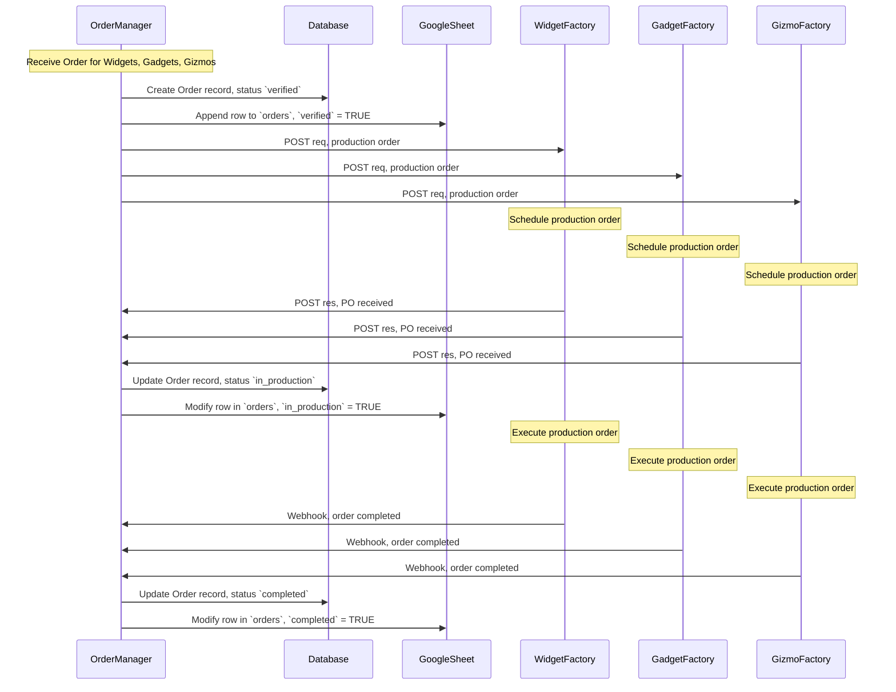
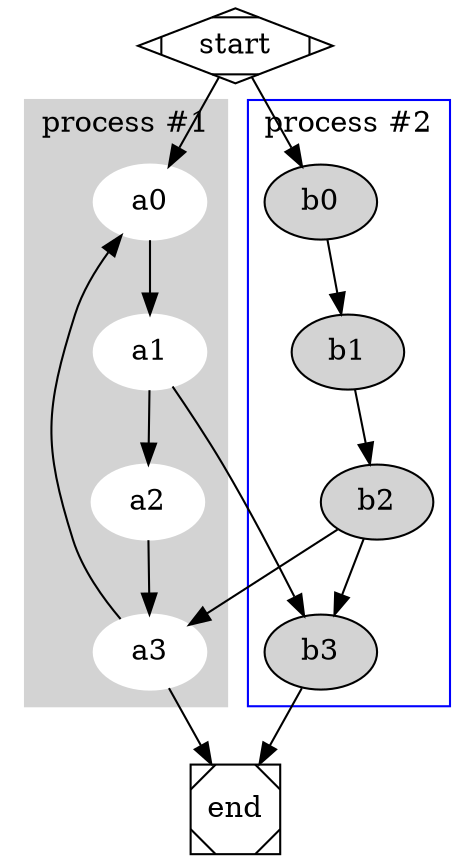

# Table of contents

one of of the following:

```
${toc}
[[toc]]
[toc]
[[_toc_]]
```
${toc}

# Image Embedding

Set size (400x200)


Dyanmic (100%)


# PlantUML

@startuml
Bob -> Alice : hello
@enduml

Or

``` plantuml
Bob -> Alice : hello
```

# KaTeX

$\sqrt{3x-1}+(1+x)^2$

$$\begin{array}{c}

\nabla \times \vec{\mathbf{B}} -\, \frac1c\, \frac{\partial\vec{\mathbf{E}}}{\partial t} &
= \frac{4\pi}{c}\vec{\mathbf{j}}    \nabla \cdot \vec{\mathbf{E}} & = 4 \pi \rho \\

\nabla \times \vec{\mathbf{E}}\, +\, \frac1c\, \frac{\partial\vec{\mathbf{B}}}{\partial t} & = \vec{\mathbf{0}} \\

\nabla \cdot \vec{\mathbf{B}} & = 0

\end{array}$$

# mermaid



# js-sequence-diagrams



# Flowchart

``` flowchart
st=>start: Start|past:>http://www.google.com[blank]
e=>end: End|future:>http://www.google.com
op1=>operation: My Operation|past
op2=>operation: Stuff|current
sub1=>subroutine: My Subroutine|invalid
cond=>condition: Yes
or No?|approved:>http://www.google.com
c2=>condition: Good idea|rejected
io=>inputoutput: catch something...|future

st->op1(right)->cond
cond(yes, right)->c2
cond(no)->sub1(left)->op1
c2(yes)->io->e
c2(no)->op2->e
```

# dot


# chart.js

``` chart
{
  "type": "pie",
  "data": {
    "labels": [
      "Red",
      "Blue",
      "Yellow"
    ],
    "datasets": [
      {
        "data": [
          300,
          50,
          100
        ],
        "backgroundColor": [
          "#FF6384",
          "#36A2EB",
          "#FFCE56"
        ],
        "hoverBackgroundColor": [
          "#FF6384",
          "#36A2EB",
          "#FFCE56"
        ]
      }
    ]
  },
  "options": {}
}
```
