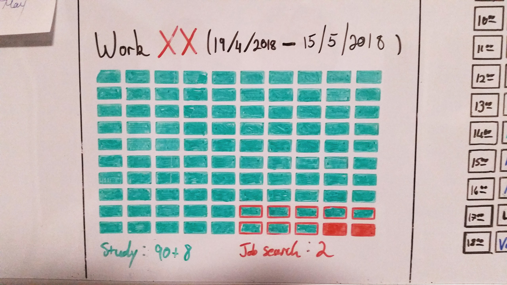

It was not a happy day when I passed the official milestone of 1,000 hours of trying to become a developer.  I was still without a job, and long, painful experience had taught me that interviews in the offing counted for little.

So I saved this photograph in a draft of this post, wiped my board clean, and stenciled out the twenty-first matrix.  I intended to write a blog post about how far I've come in my coding journey and all the things that I can work with now, of which I had scant knowledge a year-and-a-half ago — Ruby, Rails, coding puzzles, HTML, CSS, JavaScript, etc.  Instead, I turned off my computer and went to the gym.

A career change is always hard, and these days no-one cares much for the travails of a married man who dreams of providing for his family.  Looking for work is laborious, thankless, frustrating, exhausting, and depressing.  But what's the alternative?  I had to keep on going.

So the next day I turned on my System76 computer, for which I am most grateful, and spent the next few days studying hard on Udemy.  I put thoughts of whether I might get a job out of my mind and concentrated on studying and writing code — which, despite all the frustrations, I enjoy for its own sake — and to cut a long story short, fortune smiled on me two weeks later.

Those of you who follow me on LinkedIn will have noticed a small, but rather important update in my profile:

